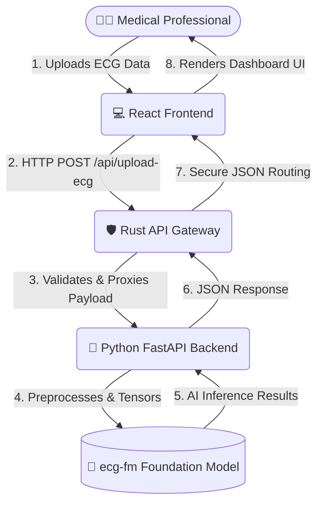

# 🫀 ECG Analyzer-Heart Disease Detection

An advanced, microservices-based application designed to analyze Electrocardiogram (ECG) data and detect cardiac anomalies using artificial intelligence and Machine Learning.

This project implements a highly scalable architecture, splitting the workload across a modern React frontend, a blazing-fast Rust API Gateway, and a heavy Python machine learning backend.

##  System Architecture

The application is built using a **Microservices Architecture** to ensure separation of concerns, high performance, and safe dependency management.

### 1. 🌐 Frontend (`ecg-dashboard`)
* **Tech Stack:** React, TypeScript, Vite, Tailwind CSS, Lucide React, Axios, React Markdown.
* **Purpose:** Provides a clean, responsive user interface for medical professionals to upload ECG files and view AI-generated diagnostic reports.

### 2. 🛡️ API Gateway (`rust-gateway`)
* **Tech Stack:** Rust, Axum, Tokio, Reqwest.
* **Purpose:** Acts as the secure bridge between the frontend and the AI engine. It provides memory-safe execution, handles concurrent connections efficiently, manages CORS, and validates incoming payloads before passing them to the expensive machine learning models.

### 3. 🧠 AI Engine (`python-backend`)
* **Tech Stack:** Python, FastAPI, PyTorch, Fairseq-signals.
* **Purpose:** A fully isolated backend dedicated entirely to data preprocessing and running the `ecg-fm` (Foundation Model) inference.

---

#  System Architecture Deep Dive

This document outlines the detailed flow of data and the architectural decisions behind the **ECG Analyzer** microservices ecosystem.

## 📊 System Flow Diagram

GitHub natively supports Mermaid diagrams. Below is the visual representation of how the application routes data from the user to the AI model and back.



## 🧩 Component Breakdown & Responsibilities

### 1. The Presentation Layer (React + Vite)
* **Directory:** `ecg-dashboard/`
* **Role:** The user-facing application.
* **Responsibilities:**
  * Provide a drag-and-drop interface for `.csv` or `.txt` ECG files.
  * Render Markdown-formatted AI diagnostic reports using `react-markdown`.
  * Ensure a responsive, accessible UI utilizing `tailwindcss` and `lucide-react` icons.
  * Manage local state and async requests to the API Gateway via `axios`.

### 2. The API Gateway (Rust + Axum)
* **Directory:** `rust-gateway/`
* **Role:** The traffic controller and security checkpoint.
* **Responsibilities:**
  * **Memory Safety & Speed:** Built in Rust to handle concurrent connections blazingly fast without memory leaks.
  * **CORS Management:** Acts as the strict boundary, only allowing requests from authorized frontend origins.
  * **Validation:** Intercepts the heavy file uploads, ensuring they meet the required schema before waking up the Python backend.
  * **Routing:** Proxies validated traffic to the internal Python worker and routes the responses back to the client.

### 3. The AI Processing Engine (Python + FastAPI)
* **Directory:** `python-backend/`
* **Role:** The heavy-lifting machine learning worker.
* **Responsibilities:**
  * **Isolation:** Keeps the fragile AI dependencies (PyTorch, `fairseq-signals`) completely isolated from the web-serving infrastructure.
  * **Data Digitization:** Converts raw CSV/Text signals into the exact 2,500-point arrays required by the model.
  * **Inference:** Loads the `ecg-fm` weights and runs the forward pass to detect arrhythmias and cardiac anomalies.
  * **Formatting:** Translates the raw tensor outputs into readable JSON for the gateway.

## 🚀 How to Run Locally

Because this is a microservices architecture, you will need to run all three services simultaneously in separate terminal windows.

### Step 1: Start the Rust API Gateway
```bash
cd rust-gateway
cargo run
```
*Runs on `http://127.0.0.1:3000`*

### Step 2: Start the AI Backend
*(Note: Ensure your Python environment with PyTorch and Fairseq is activated).*
```bash
cd python-backend
conda activate ecg-env
python main.py 
# or use: uvicorn main:app --reload
```

### Step 3: Start the React Frontend
```bash
cd ecg-dashboard
npm install
npm run dev
```
*Runs on `http://localhost:5173`*

---

## 🔒 Note on Machine Learning Weights
To maintain a clean and lightweight repository, the heavy model weights (`ecg-fm`) and specific dataset files are untracked via `.gitignore`.
